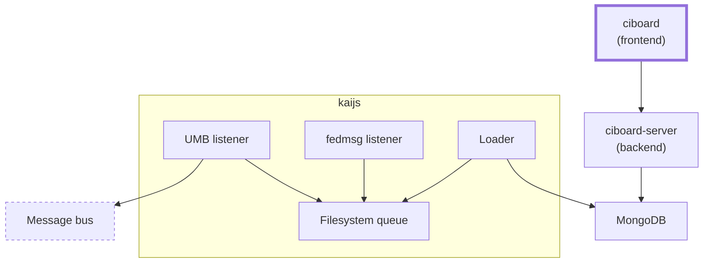

# CI Dashboard for CentOS Stream, Fedora, and other builds

## Architecture

The following diagram lays out the high-level architecture of CI Dashboard and its component packages:

## Development

To run the dashboard locally on your machine, you can simply run the `npm start` command in the project directory. This will start a server on <http://localhost:3000> where you can access the dashboard frontend.

The default settings asssume that the [backend](https://github.com/fedora-ci/ciboard-server/), i.e. the ciboard GraphQL server, is served on `/graphql` on the same host as the frontend. To override this URL, you can use the `REACT_APP_GRAPHQL_SERVER_URL` environment variable:

    $ REACT_APP_GRAPHQL_SERVER_URL=http://localhost:5000/graphql npm start

You can also use the [`.env.local` file](https://create-react-app.dev/docs/adding-custom-environment-variables/) in the project root directory to override this setting globally so that you don't have the type the long command again and again:

    $ echo 'REACT_APP_GRAPHQL_SERVER_URL=http://localhost:5000/graphql' > .env.local
    $ npm start

## Code style

In this project we follow the [Google TypeScript Style Guide](https://google.github.io/styleguide/tsguide.html).
